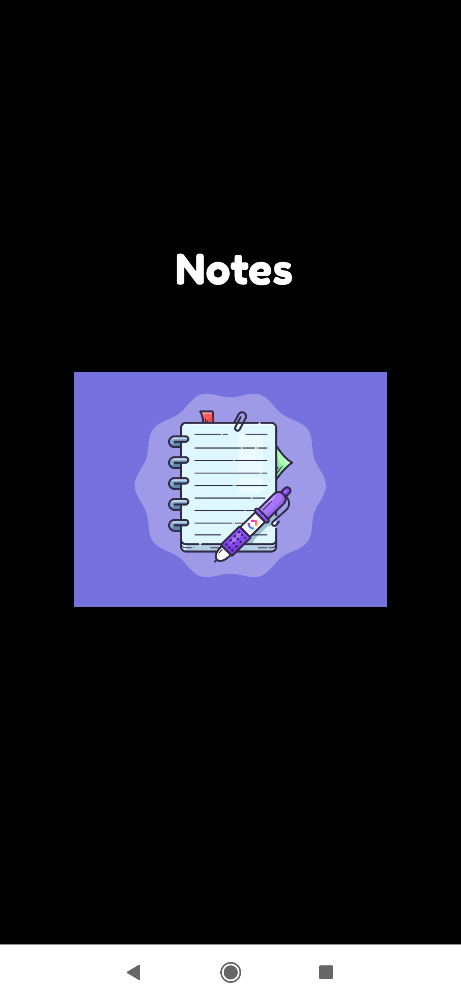
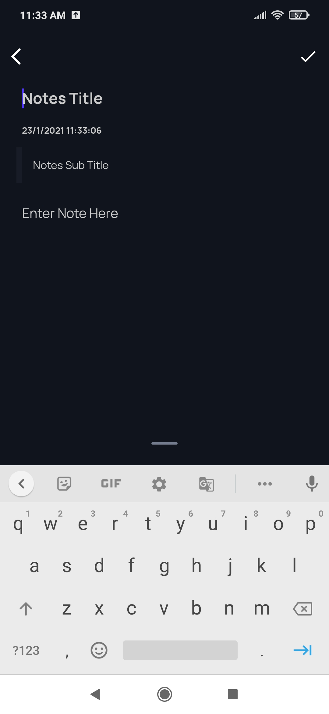
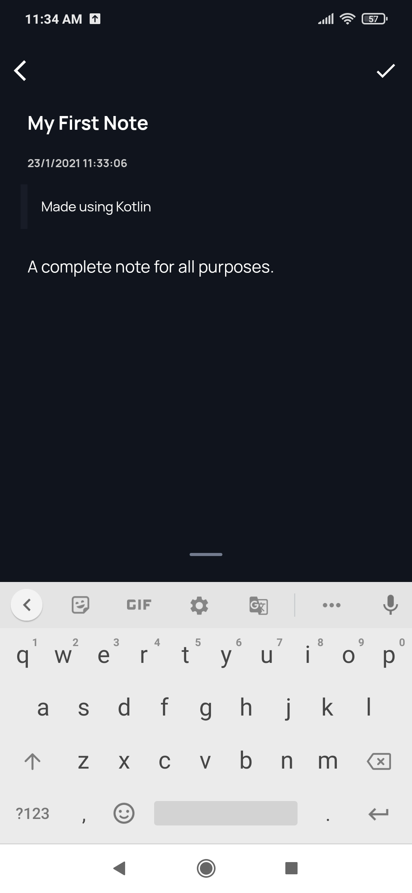
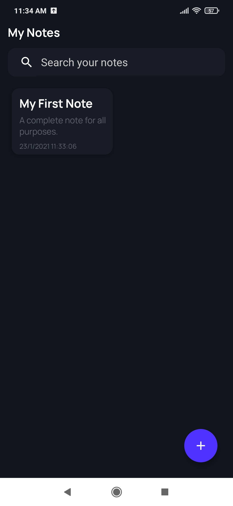

<h1>Notes App</h1> 

## Table of contents
* [General info](#general-info)
* [Technologies](#technologies)
* [Preview](#preview)

## General info
This is an android application build using Kotlin. 
It takes a different approach in making a notes for all purposes. It also records the time of the note made. 
Notes App offers a solid organisation and an excellent experience. The app also has a powerful search features with a great organisation. 

	
## Technologies
Project is created with:
* Kotlin
	
## Preview

  
  
  
  
  
  
  
 
  

